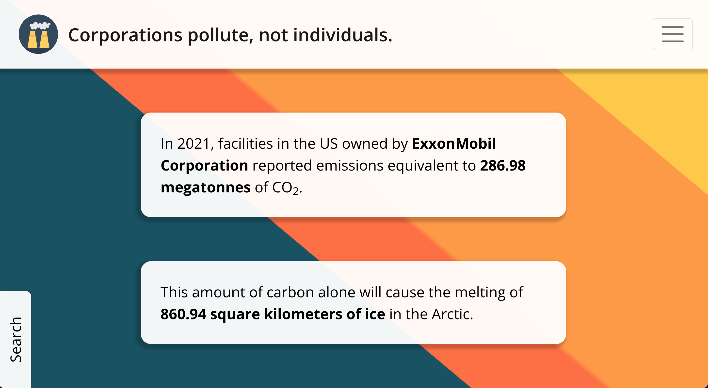

# Contextualized Carbon

Web application and API built on a stack of [Flask](https://flask.palletsprojects.com/en/2.2.x/), [Pandas](https://pandas.pydata.org/), [SQLAlchemy](https://www.sqlalchemy.org/), [PostgreSQL](https://www.postgresql.org/), [React](https://reactjs.org/), and [Nginx](https://www.nginx.com/). Deployed using [Github Actions](https://github.com/features/actions) and [Docker Compose](https://docs.docker.com/compose/) to a [Google Compute Engine](https://cloud.google.com/compute) instance.

Currently hosted at [emissions.craigf.io](https://emissions.craigf.io).



## Sources and Citations

All emissions data was obtained through the EPA's [Envirofacts Data Service API](https://www.epa.gov/enviro/envirofacts-data-service-api). The emissions data presented by the application can be most quickly verified using the EPA's [GHG search tool](https://enviro.epa.gov/envirofacts/ghg/search).

For citations regarding emissions comparison facts (e.g., the conversion rate between CO<sub>2</sub>-equivalent emissions and Arctic sea ice melt) please read [SOURCES.md](SOURCES.md).

## Installation

Running the server locally requires Docker to be installed. Development additionally requires [Python 3.10](https://www.python.org/), [Poetry](https://python-poetry.org/), [Node.js](https://nodejs.org/en/), and [npm](https://www.npmjs.com/).

### Running the development server locally

Clone the repository. [Git LFS](https://git-lfs.github.com/) may need to be installed.

The only configuration that must be prepared in advance of starting the server is the database password. Create a file `/path/to/repository/.secrets/postgres_password.txt` containing the development password of your choice. Alternatively, you can use an environment variable or bake the password directly into the Docker compose file by replacing the `POSTGRES_PASSWORD_FILE` and `EMISSIONS_DB_PASSWORD_FILE` environment variables with `POSTGRES_PASSWORD=$YOUR_PASSWORD_ENV_VAR` and/or `EMISSIONS_DB_PASSWORD=your_literal_password`.

With the database configured, simply run the following command to start the development server.

```
docker compose -f docker-compose.dev.yml up --build
```

The React webapp will be served to `localhost:3000` and the Flask API will be served to `localhost:5000/api`. Changes made to both the backend Python code or the frontend Typescript code while the server is running will trigger hot reloads in their respective containers.

### Installing required packages for development

In the `/server` directory, run

```
poetry config virtualenvs.create true --local
poetry install
```

to install all Python requirements. Note that the first line is optional but may be useful in setting up your development environment -- for example, VSCode works much better if you can point it to a virtual environment within your project.

In the `/client` directory, run

```
npm ci
```

to install all Typescript requirements.

[Black](https://black.readthedocs.io/en/stable/) and [Prettier](https://prettier.io/) are used for auto-formatting Python and Typescript code respectively. Be sure to configure both before making any code changes.

## Development workflows

### OpenAPI Generator

When, in the course of backend development, the OpenAPI spec changes for the Flask API, the frontend code that connects to it must be refreshed using [OpenAPI Generator](https://openapi-generator.tech/). Simply run

```
bash ./openapi/generate.sh
```

to perform this refresh. Verify that the correct changes were made to `/client/src/api` and that there are no type errors in frontend code that uses the API. Then check the files in via git.

### Seeding the development database

When the development server starts for the first time, the database will be empty, and (at the time of this writing) various code will fail. To create and seed the database with company data, two Flask CLI commands are provided:

```
# Create tables used by API, dropping old tables first
flask db create

# Compute company data and fill the database.
# If CSV_FILE_PATH is provided, then that starting data will be used.
# Otherwise, fresh data will be pulled from epa.gov
flask db seed [CSV_FILE_PATH]
```

Because fetching data from epa.gov is time consuming, and their API frequently encounters unexpected errors, the pre-pulled data is checked into git at `/csvdata/envirofacts_data.csv`. To seed your database:

1. Start the development server
2. Use `docker ps` to determine the ID of the container running the `emissionsbot-server` image.
3. Run the following:

```
docker cp /path/to/repository/csvdata/envirofacts_data.csv your-container-id:/server/envirofacts_data.csv
docker exec your-container-id flask db create
docker exec your-container-id flask db seed envirofacts_data.csv
```

The operation should complete in about a minute. Automating this workflow is an open task.

### Testing

Because this application was written with the intent to create a production server as quickly as possible, no testing infrastructure has been set up yet at the time of this writing. It is the most important open task currently.

See [this Github issue](https://github.com/rcraigfiedorek/emissions-facts/issues/1) to read more about testing goals and prioritization.

### Deployment

Deployment logic lives in `docker-compose.prod.yml`, `.github/workflows/update_gce.yml`, and `google/compute/instance-startup.sh`. The Docker compose file specifies how the production virtual machine should serve the application containers. The Github Actions wokflow builds and pushes the production Docker images to Dockerhub, copies the Docker compose file and the startup shell script to the virtual machine, and runs the startup script on the virtual machine. The startup script pulls the production database password from Google Cloud Secret Manager, pulls the images from Dockerhub, and serves the application using `docker compose up`.

This production environment won't scale very far if the webpage begins to see more traffic; it was chosen with absolute minimization of cloud computing costs in mind. See [this Github issue](https://github.com/rcraigfiedorek/emissions-facts/issues/5) for desired future work in deployment and cloud resource management.
